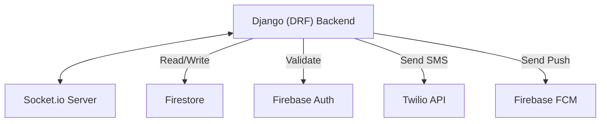

# Smart Queue Management System (SQMS) – Backend API

## Project Overview
SQMS is a real-time queue management solution built with a **Django** backend and Firebase services. It enables remote queue joining, real-time position tracking, and automated notifications for customers, while providing a comprehensive dashboard for staff and admins.

## Backend Responsibilities
The backend service handles the core business logic, including:
- **Authentication:** Secure session management using Firebase Auth and Django's authentication system with JWT role-based access control (Super Admin, Admin, Staff, Customer).
- **Queue Logic:** Managing ticket generation, status transitions (Waiting, Called, Served, Absent, Cancelled), and calculating real-time ETAs.
- **Real-time Updates:** Broadcasting queue changes to clients via Socket.io with latency under 2 seconds.
- **Notifications:** Triggering SMS alerts via Twilio and Push Notifications via Firebase Cloud Messaging (FCM).
- **Multi-Branch Support:** Managing branch configurations, service types, and operational hours.
- **Analytics:** Performance tracking (average wait times, peak hours, staff efficiency).
- **Integrations:** Third-party API management for SMS and Push services.

## Technology Stack
- **Framework:** Python (Django + Django REST Framework)
- **Database:** Firebase Firestore (NoSQL, Real-time sync)
- **Authentication:** Firebase Auth + JWT (e.g., via `djangorestframework-simplejwt`)
- **Real-time:** Socket.io (WebSockets)
- **SMS Integration:** Twilio
- **Push Notifications:** Firebase Cloud Messaging (FCM)
- **Hosting:** Railway

## Architecture Overview
The backend acts as the central hub between the web/mobile frontends and the Firebase ecosystem. It enforces security policies, processes queue transitions, and orchestrates notifications based on business rules.



## Project Structure
```text
backend/
├── core/               # Django project settings & WSGI/ASGI
├── apps/               # Django applications
│   ├── api/            # REST API endpoints (v1)
│   ├── queue/          # Queue logic & ticketing
│   ├── users/          # Custom user models & auth logic
│   └── notifications/  # Twilio & FCM integration services
├── tests/              # Unit & integration tests
├── manage.py           # Django management script
├── requirements.txt    # Python dependencies
└── README.md           # Backend documentation
```

## API Documentation
Once running, interactive API documentation is available at:
- Swagger UI (drf-spectacular): `/api/schema/swagger-ui/`
- Redoc: `/api/schema/redoc/`